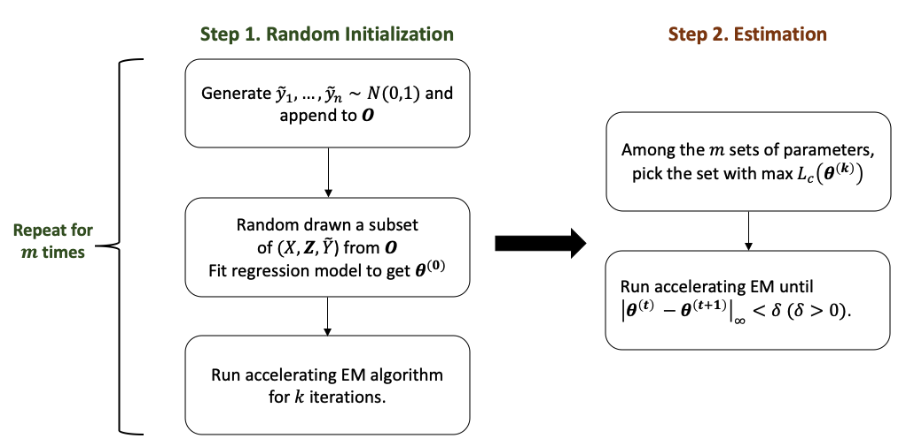
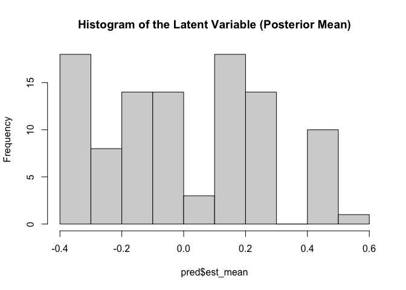
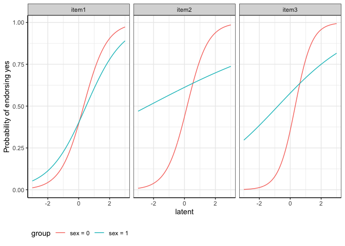

<!-- README.md is generated from README.Rmd. Please edit that file -->


`LIDIF` is designed to detect differential item functioning (DIF) in
binary and/or ordinal items.

Here we provide a sample with details on how to estimate DIF
coefficients, variance, predict the latent variable and visualize DIF
effects in categorical variables.

## Installation

You can install the development version of LIDIF like so:

``` r
library(devtools)

## install LIDIF function

install_github("ZelingH/LIDIF")

library(LIDIF)
```

# Sample Data

`LIDIF` comes with a simulated data set.

``` r
# load sample data
data(binsurvs)
```

The sample data consists of two parts. The first part contains the
binary items:

``` r
head(binsurvs$X)
#>   item1 item2 item3
#> 1     1     1     0
#> 2     1     0     1
#> 3     1     0     0
#> 4     1     0     1
#> 5     0     0     0
#> 6     0     1     1
```

Notice that we ask users to code the binary responses as 0 and 1.

The second part is the covariate information. We are interested in
testing the DIF effects for both `sex` and `age`. The continuous
covariate `age` has been standardized.

``` r
head(binsurvs$Z)
#>          age sex
#> 1  1.7858561   0
#> 2 -0.2906848   0
#> 3 -1.6375232   0
#> 4  0.7566259   1
#> 5 -0.2153077   1
#> 6 -0.6620240   1
```

## Prepare the data

In the first step, we sort our sample data into the format of `LIDIF`
function input.

``` r
surv.list = prepare_data(X = binsurvs$X, # item matrix
                         Z = binsurvs$Z # covariates matrix
                         )
```

**surv.list** is a list of two components.

## Run LIDIF function

The `LIDIF` function takes the `surv.list` as the model input and you
need to specify the types of items (binary or ordinal) in `type_list`
arguments. To improve computational efficiency, `LIDIF` leverages the
benefits of parallel computation and you can specify the number of
computing cores in `cl_num`.

Below is the estimating procedures in `LIDIF`. To ensure estimation
accuracy, LIDIF has a built-in random initialization procedure. You can
skip the random initialization by specifying your own starting point in
`init_input`. In random initialization, the default number of repeated
samples `init_nums` (m) $=30$, iterations `init_maxit` (k) $= 5$ and the
percentage of sampling `random_per` = $0.05$. These default setting
yields accurate estimation results in our simulation studies (1000
samples with 5 items). If you have fewer observations, increasing
`random_per` is recommended.



``` r
res = LIDIF(dat.list = surv.list,
            cl_num = 2, # number of cores
            type_list = "binary", # item type
            maxit = 5, # m = 1
            random_per = 0.5, # number of random samples
            init_nums = 10, # k = 2
            init_maxit = 1)
```

`LIDIF` function returns a list:

Estimated coefficients:

``` r
res$coefficients
#> $item1
#> (Intercept)         age         sex           Y       age:Y       sex:Y 
#> -0.35040012 -0.15330257  0.02454499  1.32842846  0.01397809 -0.50501653 
#> 
#> $item2
#> (Intercept)         age         sex           Y       age:Y       sex:Y 
#>  -0.7584188   1.0482617   0.7104616   1.6480740  -0.3347585  -1.2945779 
#> 
#> $item3
#> (Intercept)         age         sex           Y       age:Y       sex:Y 
#>  -0.6730431   0.1606238   0.9090364   1.9988738  -0.3031967  -1.4611568
```

Estimated variance:

``` r
res$variance
#> $item1
#> (Intercept)         age         sex           Y       age:Y       sex:Y 
#>   0.1922462   0.1024513   0.3923845   0.9567616   1.1531339   5.6940933 
#> 
#> $item2
#> (Intercept)         age         sex           Y       age:Y       sex:Y 
#>   0.4077751   0.2119354   0.4454055   1.2343915   1.0297240   1.7765825 
#> 
#> $item3
#> (Intercept)         age         sex           Y       age:Y       sex:Y 
#>   0.5495628   0.1068510   0.6313915   4.0389546   1.1220826   4.9731839
```

and the estimated variance-covariance matrix:

``` r
res$cov
```

## Inference of the DIF

Testing for individual DIF effects:

``` r
summary_LIDIF(res)
#> $item1
#>             Loading Estimate         Odds Ratio p_value   FDR BF
#> (Intercept)   -0.33    -0.35    0.7 (0.3, 1.66)   0.424 0.764  1
#> age           -0.15    -0.15  0.86 (0.46, 1.61)   0.632 0.875  1
#> sex            0.02     0.02    1.02 (0.3, 3.5)   0.969 0.990  1
#> Y              0.80     1.33 3.78 (0.56, 25.68)   0.174 0.728  1
#> age:Y          0.01     0.01  1.01 (0.12, 8.32)   0.990 0.990  1
#> sex:Y         -0.45    -0.51  0.6 (0.01, 64.84)   0.832 0.936  1
#> 
#> $item2
#>             Loading Estimate        Odds Ratio p_value   FDR   BF
#> (Intercept)   -0.60    -0.76 0.47 (0.13, 1.64)   0.235 0.728 1.00
#> age            0.72     1.05 2.85 (1.16, 7.03)   0.023 0.410 0.41
#> sex            0.58     0.71 2.03 (0.55, 7.53)   0.287 0.728 1.00
#> Y              0.85     1.65 5.2 (0.59, 45.86)   0.138 0.728 1.00
#> age:Y         -0.32    -0.33  0.72 (0.1, 5.23)   0.741 0.930 1.00
#> sex:Y         -0.79    -1.29 0.27 (0.02, 3.74)   0.331 0.728 1.00
#> 
#> $item3
#>             Loading Estimate          Odds Ratio p_value   FDR BF
#> (Intercept)   -0.56    -0.67   0.51 (0.12, 2.18)   0.364 0.728  1
#> age            0.16     0.16   1.17 (0.62, 2.23)   0.623 0.875  1
#> sex            0.67     0.91  2.48 (0.52, 11.78)   0.253 0.728  1
#> Y              0.89     2.00 7.38 (0.14, 379.14)   0.320 0.728  1
#> age:Y         -0.29    -0.30   0.74 (0.09, 5.89)   0.775 0.930  1
#> sex:Y         -0.83    -1.46     0.23 (0, 18.35)   0.512 0.838  1
```

Testing for combined uniform and non-uniform DIF effects for sex:

``` r
summary_LIDIF(res, terms = "sex")
#> $item1
#>             X2 df   Pr(>X2)
#> sex 0.05206683  2 0.9743025
#> 
#> $item2
#>           X2 df   Pr(>X2)
#> sex 1.776947  2 0.4112831
#> 
#> $item3
#>           X2 df   Pr(>X2)
#> sex 1.313009  2 0.5186612
```

## Predict the latent variable

With the output from `LIDIF` function, we could predict the latent
variable via the posterior mean and its variance via the posterior
variance.

``` r
pred = predict_LIDIF(dat.list = surv.list,
              coefs_list = res$coefficients)
```

The histogram of posterior mean:

``` r
hist(pred$est_mean, main = "Histogram of the Latent Variable (Posterior Mean)")
```



## Item Characteristic Curves (ICC)

Plot the DIF effects for sex using ICC curves:

``` r
# specify the covariate matrix
tt = cbind("age"= c(mean(surv.list$Z[,"age"]),mean(surv.list$Z[,"age"])), # age is set as population average
           "sex" = c(0,1))


getICC(res$coefficients,
       cov_mat = tt,
       compare_var = "sex",
       type_list = "binary")
```


