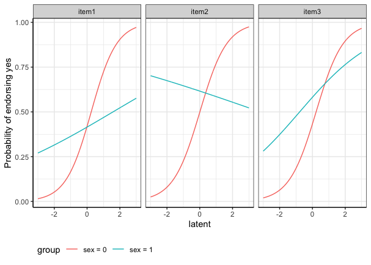

<!-- README.md is generated from README.Rmd. Please edit that file -->

The goal of LIDIF is to detect differential item functioning (DIF) in
binary and/or ordinal items.

Here we provide a sample with details steps on how to use `LIDIF` to
perform DIF analysis.

## Installation

You can install the development version of LIDIF like so:

``` r
library(devtools)
#> Loading required package: usethis

## install LIDIF function

## install_github("ZelingH/LIDIF")
library(LIDIF)
```

# Sample Data

`LIDIF` comes with a simulated data set.

``` r
# load sample data
data(binsurvs)
```

The sample data consists of two parts. The first part contains the
binary items:

``` r
head(binsurvs$X)
#>   item1 item2 item3
#> 1     1     1     0
#> 2     1     0     1
#> 3     1     0     0
#> 4     1     0     1
#> 5     0     0     0
#> 6     0     1     1
```

The second part is the covariate information. Here the `age` variable
has been standarded. We recommend standardization for continuous
covariates.

``` r
head(binsurvs$Z)
#>          age sex
#> 1  1.7858561   0
#> 2 -0.2906848   0
#> 3 -1.6375232   0
#> 4  0.7566259   1
#> 5 -0.2153077   1
#> 6 -0.6620240   1
```

## Prepare the data

In the first step, we sort our sample data into the format of `LIDIF`
function input.

``` r
surv.list = prepare_data(X = binsurvs$X, # item matrix
                         Z = binsurvs$Z # covariates matrix
                         )
```

**surv.list** is a list of two components.

## Run LIDIF function

The `LIDIF` function takes the *surv.list* as the model input and you
need to specify the types of items (binary or ordinal) in **type_list**
arguments. To improve computational efficiency, `LIDIF` leverages the
benefits of parallel computation and you can specify the number of
computing cores in **cl_num**.

Below is the estimating procedures in `LIDIF`. To ensure estimation
accuracy, LIDIF has a built-in random initialization procedure. You can
skip the random initialization by specifying your own starting point in
**init_input**. In random initialization, the default number of repeated
samples **init_nums** \$ = 30\$, iterations **init_maxit** $k = 5$ and
the percentage of sampling **random_per** = $0.05$. These default
setting yields accurate estimation results in our simulation studies
(1000 samples with 5 items). If you have fewer observations, increasing
**random_per** is recommended.

<figure>

<figcaption aria-hidden="true">Estimating procedures</figcaption>
</figure>

``` r
res = LIDIF(dat.list = surv.list,
            cl_num = 2, # number of cores
            type_list = "binary", # item type
            maxit = 5, # m = 1
            random_per = 0.5, # number of random samples
            init_nums = 10, # k = 2
            init_maxit = 1)
```

**LIDIF** function returns a list:

Estimated coefficients:

``` r
res$coefficients
#> $item1
#> (Intercept)         age         sex           Y       age:Y       sex:Y 
#> -0.26753729 -0.12745307  0.04865015  1.52478186 -0.47822628 -0.75718764 
#> 
#> $item2
#> (Intercept)         age         sex           Y       age:Y       sex:Y 
#>  -0.6800520   1.2565821   0.6828032   1.9137310  -0.1477314  -0.2630399 
#> 
#> $item3
#> (Intercept)         age         sex           Y       age:Y       sex:Y 
#>  -0.6174342   0.1491587   0.9390002   2.1183780   0.4291209   0.2838367
```

Estimated variance:

``` r
res$variance
#> $item1
#> (Intercept)         age         sex           Y       age:Y       sex:Y 
#>   0.1996285   0.1004179   0.2737492   0.7819263   0.3333367   0.8266237 
#> 
#> $item2
#> (Intercept)         age         sex           Y       age:Y       sex:Y 
#>   0.4577972   0.5016575   0.5870269   1.5493341   1.2191138   1.9972470 
#> 
#> $item3
#> (Intercept)         age         sex           Y       age:Y       sex:Y 
#>   0.5232901   0.2197835   1.1346841   4.4840501   5.8633570   9.5371450
```

and the estimated variance-covariance matrix:

``` r
res$cov
```

## Inference of the DIF

Testing for individual DIF effects:

``` r
summary_LIDIF(res)
#> $item1
#>             Loading Estimate        Odds Ratio p_value   FDR BF
#> (Intercept)   -0.26    -0.27 0.77 (0.32, 1.84)   0.549 0.899  1
#> age           -0.13    -0.13 0.88 (0.47, 1.64)   0.688 0.927  1
#> sex            0.05     0.05 1.05 (0.38, 2.93)   0.926 0.927  1
#> Y              0.84     1.52   4.59 (0.81, 26)   0.085 0.733  1
#> age:Y         -0.43    -0.48  0.62 (0.2, 1.92)   0.407 0.733  1
#> sex:Y         -0.60    -0.76 0.47 (0.08, 2.79)   0.405 0.733  1
#> 
#> $item2
#>             Loading Estimate         Odds Ratio p_value   FDR BF
#> (Intercept)   -0.56    -0.68  0.51 (0.13, 1.91)   0.315 0.733  1
#> age            0.78     1.26 3.51 (0.88, 14.08)   0.076 0.733  1
#> sex            0.56     0.68  1.98 (0.44, 8.89)   0.373 0.733  1
#> Y              0.89     1.91 6.78 (0.59, 77.74)   0.124 0.733  1
#> age:Y         -0.15    -0.15   0.86 (0.1, 7.51)   0.894 0.927  1
#> sex:Y         -0.25    -0.26 0.77 (0.05, 12.27)   0.852 0.927  1
#> 
#> $item3
#>             Loading Estimate          Odds Ratio p_value   FDR BF
#> (Intercept)   -0.53    -0.62   0.54 (0.13, 2.23)   0.393 0.733  1
#> age            0.15     0.15   1.16 (0.46, 2.91)   0.750 0.927  1
#> sex            0.68     0.94  2.56 (0.32, 20.63)   0.378 0.733  1
#> Y              0.90     2.12 8.32 (0.13, 527.84)   0.317 0.733  1
#> age:Y          0.39     0.43 1.54 (0.01, 176.82)   0.859 0.927  1
#> sex:Y          0.27     0.28    1.33 (0, 564.96)   0.927 0.927  1
```

Testing for combined uniform and non-uniform DIF effects for sex:

``` r
summary_LIDIF(res, terms = "sex")
#> $item1
#>            X2 df   Pr(>X2)
#> sex 0.7014449  2 0.7041792
#> 
#> $item2
#>            X2 df   Pr(>X2)
#> sex 0.9344367  2 0.6267432
#> 
#> $item3
#>            X2 df   Pr(>X2)
#> sex 0.7922924  2 0.6729083
```

## Predict the latent variable

With the output from **LIDIF** function, we could predict the latent
variable via the posterior mean and its variance via the posterior
variance.

``` r
pred = predict_LIDIF(dat.list = surv.list,
              coefs_list = res$coefficients)
```

The histogram of posterior mean:

``` r
hist(pred$est_mean, main = "Histogram of the Latent Variable (Posterior Mean)")
```


## Item Characteristic Curves (ICC)

Plot the DIF effects for sex using ICC curves:

``` r
# specify the covariate matrix
tt = cbind("age"= c(mean(surv.list$Z[,"age"]),mean(surv.list$Z[,"age"])), # age is set as population average
           "sex" = c(0,1))


getICC(res$coefficients,
       cov_mat = tt,
       compare_var = "sex",
       type_list = "binary")
```


<figure>

<figcaption aria-hidden="true">Comparison between racial
groups</figcaption>
</figure>
