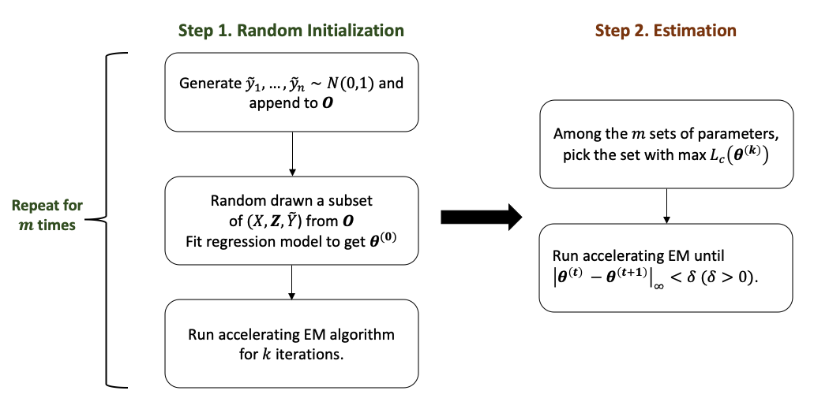
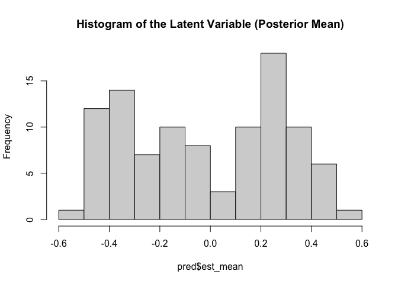
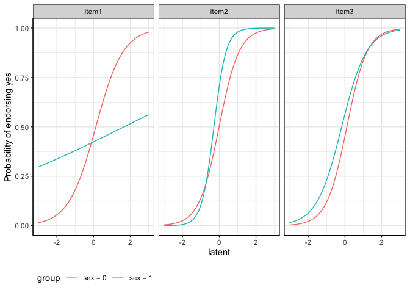

<!-- README.md is generated from README.Rmd. Please edit that file -->

The goal of LIDIF is to detect differential item functioning (DIF) in
binary and/or ordinal items.

Here we provide a sample with details steps on how to use `LIDIF` to
perform DIF analysis.

## Installation

You can install the development version of LIDIF like so:

``` r
library(devtools)
#> Loading required package: usethis

## install LIDIF function
install_github("ZelingH/LIDIF")
#> Skipping install of 'LIDIF' from a github remote, the SHA1 (3a58dde6) has not changed since last install.
#>   Use `force = TRUE` to force installation
library(LIDIF)
```

# Sample Data

`LIDIF` comes with a simulated data set.

``` r
# load sample data
data(binsurvs)
```

The sample data consists of two parts. The first part contains the
binary items:

``` r
head(binsurvs$X)
#>   item1 item2 item3
#> 1     1     1     0
#> 2     1     0     1
#> 3     1     0     0
#> 4     1     0     1
#> 5     0     0     0
#> 6     0     1     1
```

The second part is the covariate information. Here the `age` variable
has been standarded. We recommend standardization for continuous
covariates.

``` r
head(binsurvs$Z)
#>          age sex
#> 1  1.7858561   0
#> 2 -0.2906848   0
#> 3 -1.6375232   0
#> 4  0.7566259   1
#> 5 -0.2153077   1
#> 6 -0.6620240   1
```

## Prepare the data

In the first step, we sort our sample data into the format of `LIDIF`
function input.

``` r
surv.list = prepare_data(X = binsurvs$X, # item matrix
                         Z = binsurvs$Z # covariates matrix
                         )
```

**surv.list** is a list of two components.

## Run LIDIF function

The `LIDIF` function takes the *surv.list* as the model input and you
need to specify the types of items (binary or ordinal) in **type_list**
arguments. To improve computational efficiency, `LIDIF` leverages the
benefits of parallel computation and you can specify the number of
computing cores in **cl_num**.

Below is the estimating procedures in `LIDIF`. To ensure estimation
accuracy, LIDIF has a built-in random initialization procedure. You can
skip the random initialization by specifying your own starting point in
**init_input**. In random initialization, the default number of repeated
samples **init_nums** \$ = 30\$, iterations **init_maxit** $k = 5$ and
the percentage of sampling **random_per** = $0.05$. These default
setting yields accurate estimation results in our simulation studies
(1000 samples with 5 items). If you have fewer observations, increasing
**random_per** is recommended.

<figure>

<figcaption aria-hidden="true">Estimating procedures</figcaption>
</figure>

``` r
res = LIDIF(dat.list = surv.list,
            cl_num = 2, # number of cores
            type_list = "binary", # item type
            maxit = 1, # m = 1
            random_per = 0.5, # number of random samples
            init_nums = 2, # k = 2
            init_maxit = 1)
#> [1] "Outputs will be saved at: /Users/king/Dropbox/Emory/Harmonization/otherLIDIF"
#> [1] "Starting initialization ..."
#> discovered package(s): 
#> automatically exporting the following variables from the local environment:
#>   cl_num, cur_time, dat.list, evalimit, init_maxit, int_bound, optim_reltol, optim_trace, output_dir, random_per, replace, stop_at, type_list 
#> explicitly exporting variables(s): binsurvs, surv.list
#> explicitly exporting package(s): cubature, foreach
#> numValues: 2, numResults: 0, stopped: TRUE
#> numValues: 2, numResults: 1, stopped: TRUE
#> returning status FALSE
#> numValues: 2, numResults: 2, stopped: TRUE
#> calling combine function
#> evaluating call object to combine results:
#>   fun(accum, result.1, result.2)
#> returning status TRUE
#> [1] "Deciding on initialization ..."
#> [1] "Starting estimation ..."
#> [1] "-----------Iteration 1-----------"
#> discovered package(s): 
#> automatically exporting the following variables from the local environment:
#>   dat.list, est_list_curr, evalimit, fun_x_vec, int_lower_bound, int_upper_bound, optim_reltol, optim_trace 
#> explicitly exporting package(s): cubature, stats
#> numValues: 3, numResults: 1, stopped: FALSE
#> returning status FALSE
#> numValues: 3, numResults: 1, stopped: TRUE
#> numValues: 3, numResults: 2, stopped: TRUE
#> returning status FALSE
#> numValues: 3, numResults: 3, stopped: TRUE
#> calling combine function
#> evaluating call object to combine results:
#>   fun(accum, result.1, result.2, result.3)
#> returning status TRUE
#> [1] "Iteration 1 converged successfully"
#> [1] "maximum absolute change in parameters:0.22859867020042"
```

**LIDIF** function returns a list:

Estimated coefficients:

``` r
res$coefficients
#> $item1
#> (Intercept)         age         sex           Y       age:Y       sex:Y 
#>  0.07360352 -0.18662365 -0.38494068  0.57859537 -0.34238184 -0.20889800 
#> 
#> $item2
#> (Intercept)         age         sex           Y       age:Y       sex:Y 
#>  -0.6374805   0.9666424   0.6881527   0.5361422  -0.2243417   0.5258156 
#> 
#> $item3
#> (Intercept)         age         sex           Y       age:Y       sex:Y 
#> -0.50848694  0.11910981  0.72037588  0.37525231  0.05840148  0.24341364
```

Estimated variance:

``` r
res$variance
#> $item1
#> (Intercept)         age         sex           Y       age:Y       sex:Y 
#>  0.14065745  0.07207232  0.22756353  3.21212144  0.60918880  3.25507353 
#> 
#> $item2
#> (Intercept)         age         sex           Y       age:Y       sex:Y 
#>   0.3687874   0.4643817   0.5965991   3.4815319   2.3738183   5.5212140 
#> 
#> $item3
#> (Intercept)         age         sex           Y       age:Y       sex:Y 
#>  0.21277929  0.08431605  0.38944548  2.33745274  1.89478121  3.55254659
```

and the estimated variance-covariance matrix:

``` r
res$cov
#>                   item1_(Intercept)    item1_age    item1_sex     item1_Y
#> item1_(Intercept)       0.140657453 -0.032341231 -0.118257703 -0.03569029
#> item1_age              -0.032341231  0.072072320 -0.015655015 -0.07916128
#> item1_sex              -0.118257703 -0.015655015  0.227563528  0.05453220
#> item1_Y                -0.035690288 -0.079161280  0.054532205  3.21212144
#> item1_age:Y            -0.019105012  0.017933922  0.045583283 -0.51689492
#> item1_sex:Y             0.025422460  0.100204710 -0.103338769 -2.91446954
#> item2_(Intercept)      -0.033849544  0.009212383  0.009908084  0.22356723
#> item2_age               0.043863368  0.001183107 -0.021780545 -0.35804813
#> item2_sex               0.045535430 -0.012796306 -0.011863460 -0.14595770
#> item2_Y                 0.092615963  0.032441655 -0.054044144 -1.55209103
#> item2_age:Y             0.068774678  0.047337164 -0.103128022 -0.43724360
#> item2_sex:Y             0.018573447 -0.108744978  0.039824175  1.07179107
#> item3_(Intercept)      -0.049253138 -0.005552046  0.060056351  0.20574549
#> item3_age              -0.004041713 -0.015113127  0.014209463  0.07348317
#> item3_sex               0.048187412  0.008711624 -0.074473330 -0.17751037
#> item3_Y                -0.005797332  0.031618761 -0.043874565 -0.90946660
#> item3_age:Y            -0.091410074  0.058701894 -0.008786689  0.10544942
#> item3_sex:Y            -0.031170631 -0.076038344  0.124171577  1.28699740
#>                   item1_age:Y item1_sex:Y item2_(Intercept)    item2_age
#> item1_(Intercept) -0.01910501  0.02542246      -0.033849544  0.043863368
#> item1_age          0.01793392  0.10020471       0.009212383  0.001183107
#> item1_sex          0.04558328 -0.10333877       0.009908084 -0.021780545
#> item1_Y           -0.51689492 -2.91446954       0.223567229 -0.358048127
#> item1_age:Y        0.60918880  0.17548819      -0.047557241  0.073133499
#> item1_sex:Y        0.17548819  3.25507353      -0.103266759  0.205932602
#> item2_(Intercept) -0.04755724 -0.10326676       0.368787401 -0.282948282
#> item2_age          0.07313350  0.20593260      -0.282948282  0.464381661
#> item2_sex         -0.05506842  0.09716692      -0.335620531  0.273225243
#> item2_Y            0.20183898  1.21949714      -0.766872319  0.946750732
#> item2_age:Y       -0.13514611  0.61617775       0.217096278  0.173347635
#> item2_sex:Y        0.03751588 -1.13423930      -0.232224689  0.283706461
#> item3_(Intercept) -0.03314931 -0.19463191      -0.085345523  0.028142757
#> item3_age          0.04984045 -0.12095538       0.003296876 -0.054304632
#> item3_sex         -0.04707527  0.23521962       0.116388920 -0.054760991
#> item3_Y            0.18278886  0.90404014       0.288149616 -0.301168933
#> item3_age:Y        0.03553265 -0.04521830       0.195172342 -0.396781246
#> item3_sex:Y       -0.22982996 -1.22640570       0.037412485 -0.239920269
#>                     item2_sex     item2_Y item2_age:Y item2_sex:Y
#> item1_(Intercept)  0.04553543  0.09261596  0.06877468  0.01857345
#> item1_age         -0.01279631  0.03244165  0.04733716 -0.10874498
#> item1_sex         -0.01186346 -0.05404414 -0.10312802  0.03982418
#> item1_Y           -0.14595770 -1.55209103 -0.43724360  1.07179107
#> item1_age:Y       -0.05506842  0.20183898 -0.13514611  0.03751588
#> item1_sex:Y        0.09716692  1.21949714  0.61617775 -1.13423930
#> item2_(Intercept) -0.33562053 -0.76687232  0.21709628 -0.23222469
#> item2_age          0.27322524  0.94675073  0.17334763  0.28370646
#> item2_sex          0.59659911  0.76933706  0.09051492  0.62383216
#> item2_Y            0.76933706  3.48153194  0.31915439 -0.74797043
#> item2_age:Y        0.09051492  0.31915439  2.37381830 -1.04088315
#> item2_sex:Y        0.62383216 -0.74797043 -1.04088315  5.52121398
#> item3_(Intercept)  0.10686796  0.16238789 -0.01723279  0.07196207
#> item3_age         -0.01356683 -0.10068976 -0.16881363  0.09447683
#> item3_sex         -0.18431055 -0.24936888  0.03349399 -0.29314044
#> item3_Y           -0.42168329 -1.22974562 -0.23422664 -0.11751471
#> item3_age:Y       -0.48078284 -1.01142683 -1.10602331 -0.59410070
#> item3_sex:Y       -0.16747848  0.03863897 -0.18465768 -1.60835451
#>                   item3_(Intercept)    item3_age    item3_sex      item3_Y
#> item1_(Intercept)      -0.049253138 -0.004041713  0.048187412 -0.005797332
#> item1_age              -0.005552046 -0.015113127  0.008711624  0.031618761
#> item1_sex               0.060056351  0.014209463 -0.074473330 -0.043874565
#> item1_Y                 0.205745488  0.073483173 -0.177510375 -0.909466599
#> item1_age:Y            -0.033149308  0.049840446 -0.047075267  0.182788863
#> item1_sex:Y            -0.194631908 -0.120955379  0.235219620  0.904040144
#> item2_(Intercept)      -0.085345523  0.003296876  0.116388920  0.288149616
#> item2_age               0.028142757 -0.054304632 -0.054760991 -0.301168933
#> item2_sex               0.106867963 -0.013566832 -0.184310547 -0.421683288
#> item2_Y                 0.162387888 -0.100689759 -0.249368884 -1.229745621
#> item2_age:Y            -0.017232790 -0.168813626  0.033493994 -0.234226638
#> item2_sex:Y             0.071962072  0.094476826 -0.293140437 -0.117514714
#> item3_(Intercept)       0.212779290 -0.020123819 -0.215385034 -0.420424187
#> item3_age              -0.020123819  0.084316050 -0.023866240  0.030799175
#> item3_sex              -0.215385034 -0.023866240  0.389445483  0.481117910
#> item3_Y                -0.420424187  0.030799175  0.481117910  2.337452738
#> item3_age:Y            -0.183110438  0.072688852  0.306918430  0.970535850
#> item3_sex:Y             0.344915519  0.036649773 -0.202130632 -1.790982079
#>                    item3_age:Y item3_sex:Y
#> item1_(Intercept) -0.091410074 -0.03117063
#> item1_age          0.058701894 -0.07603834
#> item1_sex         -0.008786689  0.12417158
#> item1_Y            0.105449424  1.28699740
#> item1_age:Y        0.035532646 -0.22982996
#> item1_sex:Y       -0.045218298 -1.22640570
#> item2_(Intercept)  0.195172342  0.03741249
#> item2_age         -0.396781246 -0.23992027
#> item2_sex         -0.480782841 -0.16747848
#> item2_Y           -1.011426829  0.03863897
#> item2_age:Y       -1.106023308 -0.18465768
#> item2_sex:Y       -0.594100698 -1.60835451
#> item3_(Intercept) -0.183110438  0.34491552
#> item3_age          0.072688852  0.03664977
#> item3_sex          0.306918430 -0.20213063
#> item3_Y            0.970535850 -1.79098208
#> item3_age:Y        1.894781214 -0.13679765
#> item3_sex:Y       -0.136797649  3.55254659
```

## Inference of the DIF

Testing for individual DIF effects:

``` r
summary_LIDIF(res)
#> $item1
#>             Loading Estimate         Odds Ratio p_value   FDR BF
#> (Intercept)    0.07     0.07  1.08 (0.52, 2.24)   0.844 0.961  1
#> age           -0.18    -0.19   0.83 (0.49, 1.4)   0.487 0.961  1
#> sex           -0.36    -0.38  0.68 (0.27, 1.73)   0.420 0.961  1
#> Y              0.50     0.58 1.78 (0.05, 59.82)   0.747 0.961  1
#> age:Y         -0.32    -0.34  0.71 (0.15, 3.28)   0.661 0.961  1
#> sex:Y         -0.20    -0.21 0.81 (0.02, 27.86)   0.908 0.961  1
#> 
#> $item2
#>             Loading Estimate          Odds Ratio p_value   FDR BF
#> (Intercept)   -0.54    -0.64   0.53 (0.16, 1.74)   0.294 0.961  1
#> age            0.70     0.97     2.63 (0.69, 10)   0.156 0.961  1
#> sex            0.57     0.69   1.99 (0.44, 9.04)   0.373 0.961  1
#> Y              0.47     0.54  1.71 (0.04, 66.24)   0.774 0.961  1
#> age:Y         -0.22    -0.22   0.8 (0.04, 16.37)   0.884 0.961  1
#> sex:Y          0.47     0.53 1.69 (0.02, 169.23)   0.823 0.961  1
#> 
#> $item3
#>             Loading Estimate         Odds Ratio p_value   FDR BF
#> (Intercept)   -0.45    -0.51   0.6 (0.24, 1.49)   0.270 0.961  1
#> age            0.12     0.12  1.13 (0.64, 1.99)   0.682 0.961  1
#> sex            0.58     0.72   2.06 (0.6, 6.98)   0.248 0.961  1
#> Y              0.35     0.38 1.46 (0.07, 29.13)   0.806 0.961  1
#> age:Y          0.06     0.06 1.06 (0.07, 15.74)   0.966 0.966  1
#> sex:Y          0.24     0.24  1.28 (0.03, 51.3)   0.897 0.961  1
```

Testing for combined uniform and non-uniform DIF effects for sex:

``` r
summary_LIDIF(res, terms = "sex")
#> $item1
#>            X2 df  Pr(>X2)
#> sex 0.6970478  2 0.705729
#> 
#> $item2
#>            X2 df   Pr(>X2)
#> sex 0.8014658  2 0.6698289
#> 
#> $item3
#>           X2 df   Pr(>X2)
#> sex 1.443043  2 0.4860123
```

## Predict the latent variable

With the output from **LIDIF** function, we could predict the latent
variable via the posterior mean and its variance via the posterior
variance.

``` r
pred = predict_LIDIF(dat.list = surv.list,
              coefs_list = res$coefficients)
```

The histogram of posterior mean:

``` r
hist(pred$est_mean, main = "Histogram of the Latent Variable (Posterior Mean)")
```



## Item Characteristic Curves (ICC)

Plot the DIF effects for sex using ICC curves:

``` r
# specify the covariate matrix
tt = cbind("age"= c(mean(surv.list$Z[,"age"]),mean(surv.list$Z[,"age"])), # age is set as population average
           "sex" = c(0,1))


getICC(res$coefficients,
       cov_mat = tt,
       compare_var = "sex",
       type_list = "binary")
```


